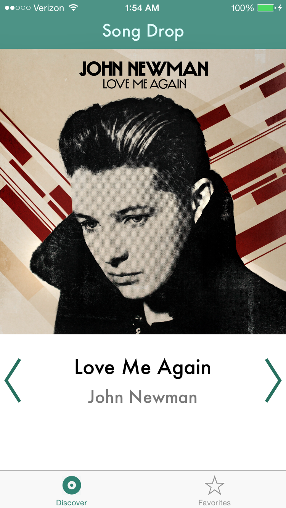
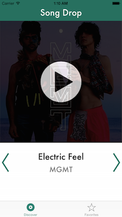

# Vesuvius
This is demo app is for a CMU startup, tenatively named "Vesuvius".

Our goal is to help upcoming artists find new audiences, and help music lovers discover the latest music. Artists will be able to select 15-second samples of their songs, and upload album art for free. Starting with iOS, app users will be able to swipe left and right to indicate whether or not they like a track, and a list of their favorite tracks will be stored.

  
